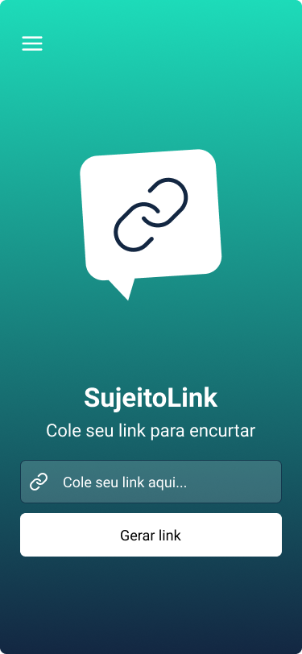
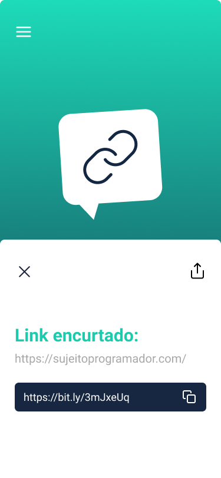
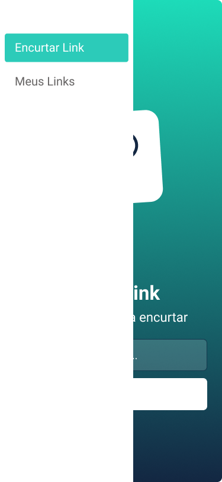
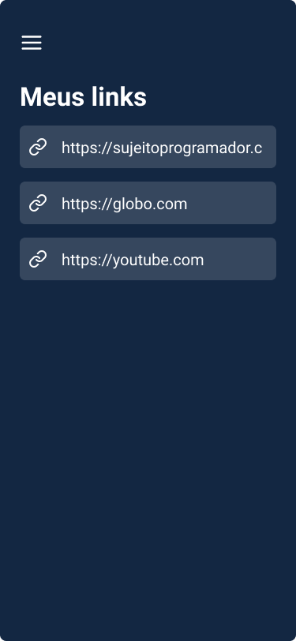
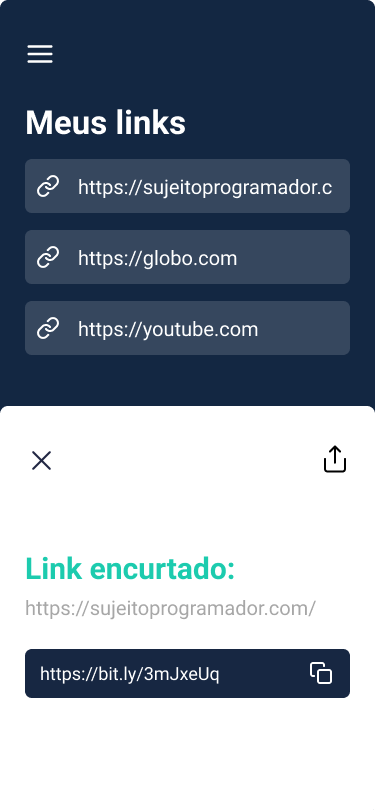
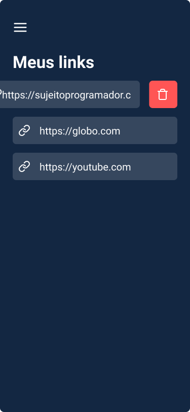

<h1>MyLink</h1>

	Encurtador de urls desenvolvido em React Native e consumindo uma API atraves de requisições HTTP,
	toda a interface foi projetada com o foco na experiencia do usuario, contendo navegação de páginas
	em Drawer.

<!--<h2>Telas do app:</h2>

	
	
	

	
	
	

-->